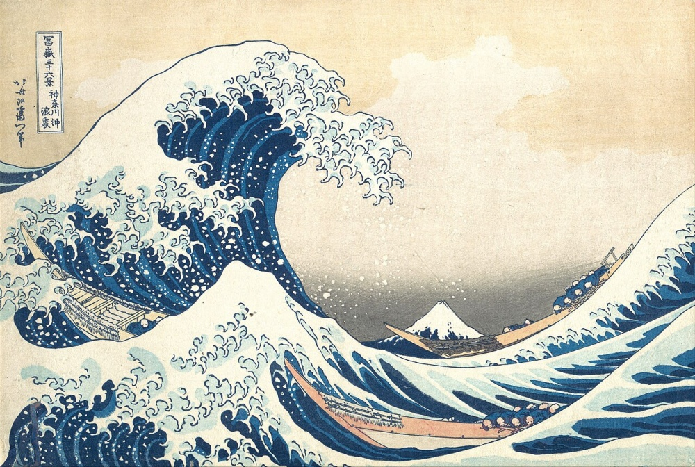
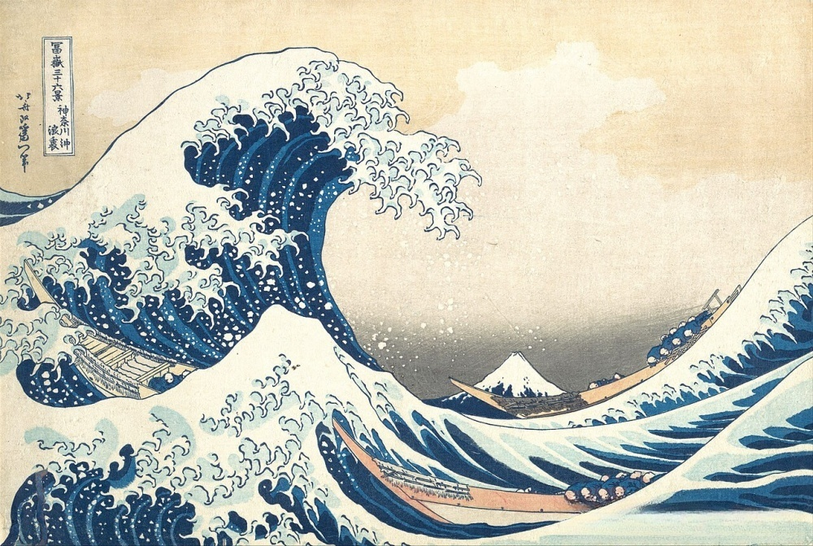

[](https://dl.circleci.com/status-badge/redirect/gh/Jurph/untext/tree/main)

# untextre

A tool for removing watermarks from images using consensus detection, Figure of Merit color analysis, and GPU-accelerated inpainting. The goal is to mask only the watermark pixels, then use inpainting to fill them in.

## Example

<table align="center">
  <tr>
    <th width="33%">Original</th>
    <th width="34%">Watermarked</th>
    <th width="33%">Cleaned</th>
  </tr>
  <tr>
    <td></td>
    <td></td>
    <td></td>
  </tr>
  <tr>
    <td align="center"><em>Hokusai, c. 1831</em></td>
    <td align="center"><em>"UkiyoEfans.jp"</em></td>
    <td align="center"><em>untextre + LaMa</em></td>
  </tr>
</table>

## Key Features

* **Text Detection via Three-Model Consensus**: Combines three text detection methods ([EAST](https://arxiv.org/abs/1704.03155), [DocTR](https://github.com/mindee/doctr), [EasyOCR](https://github.com/JaidedAI/EasyOCR)) to find regions where multiple detectors agree, for higher-confidence text detection
* **Figure of Merit (FOM) Analysis**: Within regions detected as containing text, identifies text-like color clusters using a weighted combination of TF-IDF distinctiveness, border underrepresentation, and connected-component fragmentation
* **Known Watermark Detection via [ORB](https://doi.org/10.1109/ICCV.2011.6126544) feature matching** (`-K`): If you have already isolated the watermark to an RGBA file in .PNG format, place it in the `/watermarks` directory and if it matches the watermark on an image, `untextre` will use that watermark's mask instead of the slower text-detection and color-estimation approach. Matching is done via ORB (Oriented FAST and Rotated BRIEF).
* **Automatic Watermark Discovery** (`-U`): Given a directory of at least 3 same-resolution images that all carry the same watermark, automatically discovers the template by finding pixels with near-zero population variance across the full image stack. Discovered templates are saved as RGBA PNGs for future reuse with `-K`. Works best with large, consistent image sets.
* **Inpainting**: [LaMa](https://arxiv.org/abs/2109.07161) (default) or [TELEA](https://doi.org/10.1080/10867651.2004.10487596) inpainting, applied only to masked regions

## How It Works

**untextre** uses the following approach: 

1. **Consensus Detection**: Runs EAST, DocTR, and EasyOCR detectors to find text regions where 2+ detectors agree; also runs ORB (Oriented FAST and Rotated BRIEF) against known watermarks that are stored in `/watermarks` to see if there's an obvious match
2. **Color Clustering**: For each consensus region, clusters all colors (inside and surrounding) using K-means
3. **Figure of Merit Scoring**: Evaluates each cluster with a weighted FOM combining TF-IDF score (color distinctiveness vs. background), border ratio (text underrepresented at bbox edges), and connected-component fraction (text is fragmented, not one solid blob)
4. **Adaptive Masking**: Accepts clusters whose FOM exceeds a threshold and whose largest connected component is below a guard value, then applies morphological cleanup
5. **Regional Processing**: Each consensus region gets its own color analysis, allowing different text colors in different areas
6. **Inpainting**: Combines regional masks and applies LaMa or TELEA inpainting to fill in the masked areas

The underlying engine works as a command-line tool or as a web UI. I've tried to strike a careful balance between exposing all of the dials and creating a simple and fast user experience. 

## Installation

### Prerequisites

- **Python 3.10+**
- **GPU (recommended)**: NVIDIA GPU with [CUDA toolkit](https://developer.nvidia.com/cuda-downloads) installed. Verify with `nvidia-smi`. CPU-only works but LaMa inpainting will be slow.

### Step 1: Create a virtual environment

```bash
python -m venv venv

# Activate it:
# Windows (PowerShell)
.\venv\Scripts\Activate.ps1
# Windows (cmd)
venv\Scripts\activate.bat
# Linux / macOS
source venv/bin/activate
```

### Step 2: Install PyTorch (with CUDA support)

Install PyTorch **before** the other dependencies. The `requirements.txt` intentionally excludes torch because `pip install torch` from PyPI pulls a CPU-only build that will silently overwrite a CUDA-enabled installation.

Visit the [PyTorch "Get Started" page](https://pytorch.org/get-started/locally/) and select your OS, package manager, Python version, and CUDA version. Then run the generated command:

```bash
# Example for Windows/Linux with CUDA 12.4
pip install torch torchvision torchaudio --index-url https://download.pytorch.org/whl/cu124

# Example for CPU-only
pip install torch torchvision torchaudio --index-url https://download.pytorch.org/whl/cpu
```

### Step 3: Install remaining dependencies

```bash
# Core dependencies (detection, masking, inpainting)
pip install -r requirements.txt

# Optional: web interface (Streamlit)
pip install -r requirements_streamlit.txt

# Optional: development tools (pytest, black, flake8, mypy)
pip install -r requirements_dev.txt
```

## Usage

**untextre** provides two interfaces for removing text watermarks:

### Web Interface (Recommended for Beginners)

The easiest way to use **untextre** is through the web interface — drag and drop images in your browser.

**Quick Start:**
```bash
# Install web interface dependencies
pip install -r requirements_streamlit.txt

# Launch the web interface
python run_web_interface.py
```

The interface will open automatically at `http://localhost:8501`

**Web Interface Options:**
- **Confidence Threshold** (0.1-0.9): Lower = detect more text, higher = more conservative
- **Color Granularity** (3-20): Number of color clusters for text detection. Default of 4 works well for most images. Increase for low-contrast watermarks where 4 is too aggressive.
- **Inpainting Method**: LaMa (high quality) or TELEA (fast) 
- **Color Sensitivity** (0-32): Tolerance around a user-specified target color. Only relevant when a target color is provided.
- **Show Masks**: Display detected text regions for debugging

### Command Line Interface

For batch processing, automation, or advanced control, use the command line:

**Basic Syntax:**
```bash
python -m untextre.cli -i <input> -o <output> [options]
```

**CLI Quick Start:**

**Single image:**
```bash
python -m untextre.cli -i image.jpg -o cleaned_image.jpg
```

**Batch processing:**
```bash
python -m untextre.cli -i input_folder/ -o output_folder/
```

**With debug info:**
```bash
python -m untextre.cli -i image.jpg -o results/ --keep-masks --verbose --timing
```

**Command-Line Options:**

#### Required Arguments

* `-i`, `--input` - Input image file or directory containing images
* `-o`, `--output` - Output file (for single image) or directory (for batch processing)

#### Detection & Analysis

* `--confidence-threshold FLOAT` - Confidence threshold for consensus detection (default: 0.3)
  - Lower values (0.1-0.2): More sensitive, may include false positives
  - Higher values (0.4-0.6): More conservative, may miss faint text

* `-g`, `--granularity K` - Override TF-IDF cluster count (e.g. 4, 8). If set, uses this K only (no retry). Defaults to 4, with an automatic second pass at 8 if remnants are detected.

* `--no-expand` - Disable automatic bbox expansion along long axis
  - By default, detected bboxes are expanded to catch text that detectors may have missed
  - Use this flag if expansion is capturing too much background

* `--no-retry` - Disable automatic retry with granularity=8
  - By default, CLI uses g=4 and auto-retries with g=8 if text remnants are detected
  - Use this flag to skip the retry pass for faster processing

#### Input/Output Control

* `-K`, `--known-mask PATH` - Path to RGBA PNG of a known watermark/logo template
  - Uses ORB feature matching to find the template at any scale/position
  - The alpha channel defines which pixels to mask
  - **Skips consensus detection** — about 10x faster for consistent watermarks
  - Example: `--known-mask logo_template.png`

* `-U`, `--unknown-watermark` - Auto-discover the watermark from the input directory, then process all images with the discovered template
  - **Requires a directory input** (not a single file)
  - Needs at least **3 images at the same resolution** to perform discovery; buckets with fewer than 3 images are skipped
  - Works best with **10 or more congruent images** — more images mean tighter variance and a cleaner template
  - All images should carry the **same watermark**; mixing watermarked and unwatermarked images degrades discovery quality
  - Saves the discovered template as `watermark_candidate.png` (and `watermark_candidate_2.png` etc. for multiple distinct marks) in the output directory for future reuse with `-K`
  - Mutually exclusive with `-K`
  - Example: `--unknown-watermark` (requires `-i` to be a directory)

* `-c`, `--color COLOR` - Target text color as hex (#FF0000) or HTML name (red). Text colors are normally detected automatically via FOM analysis. This flag triggers immediate color enhancement if consensus detection finds no regions. Use for subtle watermarks that standard detection misses.

* `-m`, `--maskfile PATH` - Use existing mask file instead of generating one

* `-f`, `--force-bbox X,Y,W,H` - Force specific bounding box (x,y,width,height) where x,y is the top-left corner
  - Example: `--force-bbox 100,200,300,50` for 300x50 region at position (100,200)

#### Inpainting Options

* `-p`, `--paint METHOD` - Inpainting method (default: lama)
  - `lama`: High-quality deep learning inpainting (recommended)
  - `telea`: Fast OpenCV inpainting method

* `--device cuda|cpu` - Device for LaMa inference (default: cuda)

#### Debug & Monitoring

* `-k`, `--keep-masks` - Save debug masks alongside output images

* `-t`, `--timing` - Generate detailed timing reports

* `-l`, `--logfile PATH` - Save detailed logs to file

* `-v`, `--verbose` - Enable verbose console output

**CLI Advanced Examples:**

**High-precision processing:**
```bash
python -m untextre.cli -i photos/ -o cleaned/ --confidence-threshold 0.4
```

**Fast processing (skip retry pass):**
```bash
python -m untextre.cli -i images/ -o results/ --no-retry --paint telea
```

**Debug and analyze performance:**
```bash
python -m untextre.cli -i test.jpg -o debug/ --keep-masks --timing --verbose --logfile process.log
```

**Force specific region:**
```bash
python -m untextre.cli -i logo.png -o clean.png --force-bbox 50,100,200,30
```

**Remove known watermark using template matching:**
```bash
python -m untextre.cli -i photos/ -o cleaned/ -K watermark_template.png
```

**Auto-discover watermark from a batch of consistently-watermarked images:**
```bash
python -m untextre.cli -i watermarked_photos/ -o cleaned/ -U
```
This scans the directory, identifies pixels that are identical across all same-resolution images, and saves the discovered template as `cleaned/watermark_candidate.png`. All images are then processed against that template. On the next batch from the same source, you can skip discovery entirely with `-K cleaned/watermark_candidate.png`.

**Override granularity:**
```bash
python -m untextre.cli -i photos/ -o cleaned/ -g 8
```

## Performance Tips

* **First run**: Model loading takes 10-15 seconds, then processing is fast
* **Batch processing**: Models loaded once, subsequent images process in 2-5 seconds. VRAM is automatically cleaned between images.
* **Granularity**: CLI uses g=4 by default with auto-retry at g=8 if remnants detected. Web UI lets you choose (3-20).
* **Confidence**: Start with 0.3, increase to 0.4-0.5 if too many false positives
* **Speed vs Quality**: Use `--no-retry` for faster processing, or `--paint telea` for CPU-only inpainting

## Output Files

When processing images, **untextre** generates several files:

### Cleaned Image  
* `image_clean.jpg` - Main result with text removed (high-quality JPEG at 95% quality)

### Image Mask File (with `--keep-masks`)
* `image_mask.png` - Binary mask showing detected text regions (white = text, black = background)

### Timing Reports (with `--timing`)
* `timing_report.txt` - Detailed performance metrics including:
  - Per-image processing times (detection, TF-IDF, masking, inpainting)
  - Consensus region counts and success rates
  - Average times and statistics for batch processing

## Troubleshooting

### No Consensus Regions Detected
If no text regions are found, try:
* Lower confidence threshold: `--confidence-threshold 0.025` improves the odds that two detectors will guess the same area 
* Use forced bounding box: `--force-bbox x,y,width,height`

### Poor Color Detection
If wrong colors are being masked:
* **CLI**: The auto-retry with g=8 usually handles this. If still problematic, the region may need manual adjustment in the web UI.
* **Web UI**: Adjust the granularity slider (3-20). Lower values (3-6) are more aggressive, higher values (12-20) are more selective. 

### Debugging
* The `-v / --verbose` option will show what's happening at each step 
* The `-k / --keep-masks` option will let you see what the model ended up removing  
* The `-l / --logfile {filename}` option stores logs in a file of your choice 


## Technical Details

### Watermark Detection

The system runs **ORB** against the target image, testing all of the transparent PNG images found in the `watermarks/` subfolder. If a match is found, the image's alpha channel is used to construct a binary mask for the watermark. If no known watermarks are found, it runs three different text detection algorithms:

- **EAST**: Fast OpenCV-based detection
- **DocTR**: Deep learning document text recognition  
- **EasyOCR**: OCR-based text detection

Regions where 2 or more detectors agree (with configurable overlap threshold) become "consensus regions" — areas likely to contain text.

### Auto-Discovery (`-U`)

When the source of a watermark is unknown, `-U` finds it automatically using population variance across the image stack:

1. **Bucketing**: Images are grouped by exact pixel dimensions. Any bucket with fewer than 3 images is skipped for self-discovery (too few samples to separate watermark from content).
2. **Variance stacking**: For each qualifying bucket, every image is converted to grayscale and the per-pixel population variance is computed incrementally using Welford's algorithm — one image loaded at a time, so memory scales with image size rather than batch size.
3. **Variance normalization**: The per-pixel variance image is log-scaled and normalized to 0-255, so the darkest values represent the most stable pixels in that bucket and the bright values represent normal image-content variation.
4. **Support extraction**: Otsu thresholding is applied to that normalized variance map to get a broad low-variance support mask. This adapts to each bucket's own variance distribution instead of relying on a fixed watermark threshold.
5. **Core-connected threshold sweep**: Within each support component, discovery finds the darkest connected core and then sweeps the threshold upward through the 0-255 variance field. At each level it keeps only the connected region containing that core.
6. **Knee selection**: Each growth stage is scored for darkness concentration, fill, and compactness. Discovery keeps the threshold level where the core-connected region is still compact and coherent, before diffuse low-variance background starts to dominate. Weak compact outliers are filtered using a bucket-relative score fence rather than a fixed watermark-size ceiling.
7. **Template crop**: Each surviving candidate region is cropped from the pixel-wise mean of the bucket with an 8-pixel transparent border. The alpha channel is the candidate mask.
8. **Cross-bucket validation**: If images at multiple resolutions all carry the same watermark (scaled), their candidate crops are compared by IoU on the alpha channel. Crops with IoU ≥ 0.5 are merged into one family; the largest crop (most ORB keypoints) is kept as the canonical template.

The discovered template is saved to the output directory and immediately used to process every image in the batch via the standard ORB pipeline. Save it and pass it to `-K` on future batches to skip the discovery step.

### Figure of Merit (FOM) Analysis

In a region where text is known to exist, we identify the text color by scoring each color cluster on multiple axes:

1. Generate a surrounding region outside the detection bbox, with roughly the same pixel count as the detection region (the "local background")  
2. Cluster all colors in both regions using K-means (CLI: g=4 with auto-retry at g=8; Web UI: user-configurable 3-20)
3. For each cluster, compute three signals:
   - **TF-IDF score**: How distinctive is this color to the detection region vs. local background?
   - **Border ratio**: Is this color underrepresented at the edges of the bbox? (Text tends to sit in the interior.)
   - **Connected-component fraction**: Is this color fragmented into many small shapes? (Text strokes are fragmented; solid backgrounds are not.)
4. After empirically sampling multiple text watermarks across multiple datasets, we derived coefficients for this Figure of Merit: `FOM = 0.07 * tf_idf + 0.63 * border + 0.30 * cc` 
5. Accept clusters with FOM >= 0.30 and largest connected component < 85% of the cluster area
6. The accepted clusters form the binary mask, cleaned up with morphological operations (closing, dilation, blur)

### Inpainting 

**LaMa** on GPU offers a good balance of speed and quality. Diffusion models can produce better results but are much slower; CPU-bound methods like **Telea** (our fallback, via OpenCV) are faster but produce more visible artifacts. LaMa handles irregular mask shapes well and does a reasonable job continuing patterns like wood grain, paint textures, and stripes.

### Bibliography

1. Suvorov, R.; Logacheva, E.; Mashikhin, A.; Remizova, A.; Ashukha, A.; Silvestrov, A.; Kong, N.; Goka, H.; Park, K.; Lempitsky, V. "Resolution-robust Large Mask Inpainting with Fourier Convolutions." *WACV*, 2022. [arXiv:2109.07161](https://arxiv.org/abs/2109.07161) — **LaMa**
2. Zhou, X.; Yao, C.; Wen, H.; Wang, Y.; Zhou, S.; He, W.; Liang, J. "EAST: An Efficient and Accurate Scene Text Detector." *CVPR*, 2017. [arXiv:1704.03155](https://arxiv.org/abs/1704.03155) — **EAST**
3. Liao, M.; Wan, Z.; Yao, C.; Chen, K.; Bai, X. "Real-Time Scene Text Detection with Differentiable Binarization." *AAAI*, 2020. [arXiv:1911.08947](https://arxiv.org/abs/1911.08947) — **DBNet**, the detection backbone used by [DocTR](https://github.com/mindee/doctr)
4. Baek, Y.; Lee, B.; Han, D.; Yun, S.; Lee, H. "Character Region Awareness for Text Detection." *CVPR*, 2019. [arXiv:1904.01941](https://arxiv.org/abs/1904.01941) — **CRAFT**, the detection model used by [EasyOCR](https://github.com/JaidedAI/EasyOCR)
5. Rublee, E.; Rabaud, V.; Konolige, K.; Bradski, G. "ORB: An Efficient Alternative to SIFT or SURF." *ICCV*, 2011, pp. 2564–2571. [DOI:10.1109/ICCV.2011.6126544](https://doi.org/10.1109/ICCV.2011.6126544) — **ORB**
6. Telea, A. "An Image Inpainting Technique Based on the Fast Marching Method." *Journal of Graphics Tools*, vol. 9, no. 1, 2004, pp. 23–34. [DOI:10.1080/10867651.2004.10487596](https://doi.org/10.1080/10867651.2004.10487596) — **TELEA**

### License

MIT
